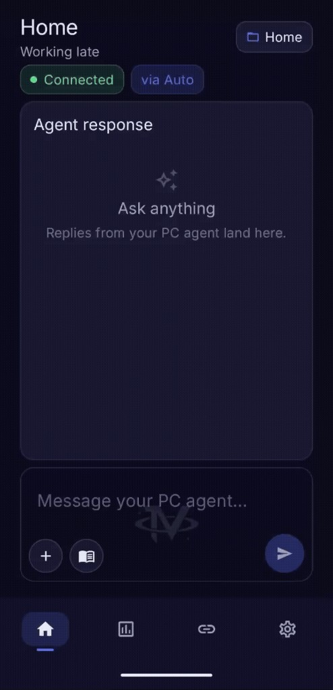

Invictus Link is a small Android app that talks to a bridge on **your** PC. You type on your phone; Cursor, Grok, or a local model answers from the machine on your desk — over your own network.

I built this because I wanted it. If it’s useful to you too, take it, run it, change it, make it yours.

### What’s new in v2.0

**Multi-provider**
- Connect **Cursor** (full coding agent on the PC), **xAI / Grok**, **OpenAI**, **Claude**, **Gemini**, **Ollama**, **LM Studio**, or any **OpenAI-compatible** server
- Manual pick, or **Auto** routing (agent work → Cursor, research → Grok, quick stuff → local when it’s up)
- API keys stay on the PC — the phone only ever sees a masked tail

**Grok / xAI**
- Real conversation threads (not one-shot prompts)
- Vision for photos you attach from the phone
- Web / X search when the question needs it
- **Prompt caching** so follow-ups reuse the stable prefix instead of re-billing the whole chat every time

**On our own Grok usage** (live bridge logs, ~36 completes):
- Average cache hit rate: **~57%**
- Estimated input-cost savings vs the same prompts with no cache: **~43%**
- Warm follow-up streaks often land in the **mid–high 90%s** hit rate

Those numbers are from real chats on this setup — not a lab demo. Yours will vary with thread length and how often the model / system prompt changes.

**Local models**
- Point the bridge at Ollama or LM Studio on the same PC
- No cloud key required; replies stay on your machine
- We tested chat on a local Llama build — connected cleanly and felt fast

**Phone UX**
- Home: streaming replies, sessions, attachments (camera / gallery / files)
- Activity: spend dashboard, cache savings, daily chart, optional limits
- Settings: providers, standing rules, OTA update / publish from the PC
- Prompt library with `{{variables}}`, Markdown export of a conversation
- Stop an in-flight reply; restart the bridge from the phone when you need it

**UI polish**
- Cosmic IV launcher icon
- Navy Invictus shell, clearer provider cards, quieter chrome
- Small quality-of-life passes on Home, Activity, and Settings

### Make it yours

This isn’t a locked product. Once Link is talking to Cursor on your PC, you can literally text the app a change — a new color, a different layout, a feature you wish existed — and Cursor will edit the code on your machine, build an update, and push it to **your** bridge. Then you install it from Settings inside the app.

That’s how I built most of this: describe it from the phone, let the agent ship it, update on-device. Fully customizable, in minutes, in your own words.

### What we actually tested

| Provider | Status |
|----------|--------|
| **xAI / Grok** | Daily driver — chat, images, caching, costs |
| **Cursor** | Agent path on the PC |
| **Ollama (local Llama)** | Connected and chatted — quick replies |

OpenAI, Claude, Gemini, and LM Studio are wired the same way. We didn’t run paid keys on every cloud for this release; if you have a key or a local server, you should be able to connect from Settings without waiting on us.

### Install

**New setup:** start with `START_HERE.txt`, set up the bridge, then pair the phone.  
**Already on Link:** update/restart the bridge, then Settings → Check for update → Install.

Or download / clone the repo, open that folder as a workspace in Cursor, and ask:

> scan the workspace and walk me through set up

Cursor can walk you through what you need to get Invictus Link running. Enjoy.

Your prompts and keys stay on infrastructure you control. There’s no Invictus cloud in the middle.

### Credits

**Seth Naasko** — built it.  
**Gavin Naasko** — helped originate the name *Invictus*.

MIT. Fork it, break it, improve it.
