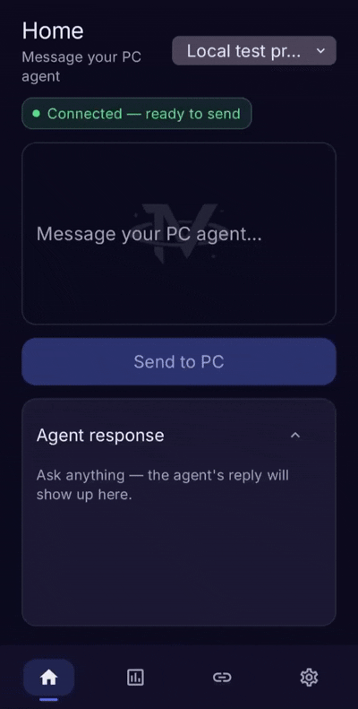
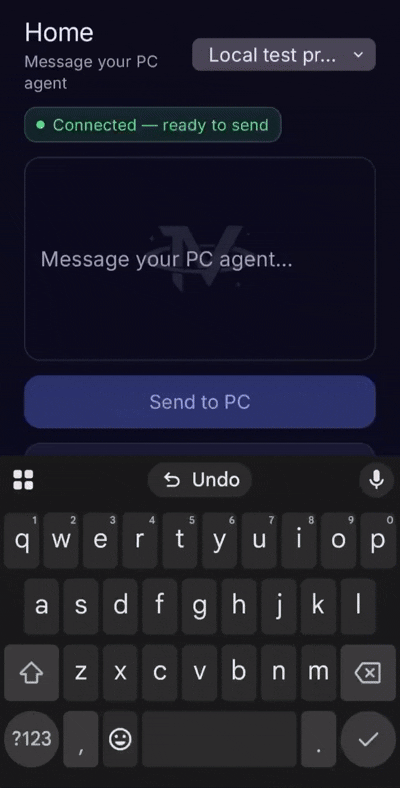

# Invictus Link

**Your universe, your way.** — Native Android control for the agent on your PC.

**Latest release:** [v1.74](release/InvictusLink.apk) — download `release/InvictusLink.apk` or grab the APK from [GitHub Releases](https://github.com/InvictusSn/InvictusLink/releases).

Invictus Link is an **independent open-source project (MIT)**. It is **not affiliated with, endorsed by, or sponsored by** any third-party IDE or agent vendor.

---

## Why Invictus Link?

Many proprietary companion apps focus on **hosted agents** and supervising work from anywhere. That is a solid model when you want cloud-first workflows.

**Invictus Link is built for a different job:** a **native Android** app that connects to the agent on **your own PC**, over **your private network**.

| | Typical hosted companion apps | Invictus Link |
|---|------------------------------|---------------|
| **Android experience** | Often web-based or platform-specific | **Native APK** |
| **Where the agent runs** | Remote / hosted infrastructure | **Your PC** — your projects, tools, and environment |
| **Network path** | Vendor infrastructure | **Your VPN** (Tailscale or WireGuard) |
| **Source & license** | Proprietary | **MIT — inspect, fork, self-host** |
| **Phone ↔ PC link** | Vendor-managed | **Your bridge** on your machine |

**Invictus Link is a strong fit if you want to:**
- Keep prompts and agent work on **hardware you control**
- Use **native Android** (not a browser shortcut)
- Run agents against **local projects** with your existing desktop setup
- **Self-host** the phone ↔ PC link and adapt the stack

**Invictus Link is not trying to replace** full hosted-agent platforms, team dashboards, or broad device-node ecosystems. Those solve different problems. Link is intentionally narrow:

**phone → your PC → your agent → your code.**

### Who it is for / not for

| For | Not for |
|-----|---------|
| Self-hosters and local-first developers | Cloud-only hosted agent workflows |
| Native Android users | Full mobile device-node platforms (camera, canvas, etc.) |
| Privacy-minded VPN setups (Tailscale / WireGuard) | Turnkey proprietary companion ecosystems |

---

## Quick start

1. **Install Invictus Link** — [release/InvictusLink.apk](release/InvictusLink.apk) or [FIRST_INSTALL_AND_UPDATES.md](docs/FIRST_INSTALL_AND_UPDATES.md) (one-time QR).
2. **VPN** — [Tailscale](docs/TAILSCALE_SETUP.md) (easiest) or [WireGuard / Pi hub](docs/RASPBERRY_PI_VPN_HUB.md).
3. **PC bridge** — [PC_BRIDGE_SETUP.md](docs/PC_BRIDGE_SETUP.md): `npm install` → `npm run build` → `.env` from `.env.example` → `npm start`.
4. **Projects** — edit `bridge/config/projects.json` with your workspace path.
5. **Connect** — in Invictus Link: `http://YOUR-PC-IP:3003` + your pairing code.
6. **Home** — New Session → send a prompt.

**Updates after first install:** Settings → Check for update → Install update (no new QR). See [USER_GUIDE.md](docs/USER_GUIDE.md).

New here? Start with [START_HERE.txt](START_HERE.txt).

---

## What’s in this repo

| Path | Purpose |
|------|---------|
| [START_HERE.txt](START_HERE.txt) | Fastest path to first prompt |
| [release/InvictusLink.apk](release/InvictusLink.apk) | Pre-built Android app |
| [docs/FIRST_INSTALL_AND_UPDATES.md](docs/FIRST_INSTALL_AND_UPDATES.md) | Desktop setup, one-time install QR, in-app updates |
| [docs/USER_GUIDE.md](docs/USER_GUIDE.md) | Daily use (sessions, prompts, updates) |
| [docs/PC_BRIDGE_SETUP.md](docs/PC_BRIDGE_SETUP.md) | Run the bridge on a PC |
| [docs/TAILSCALE_SETUP.md](docs/TAILSCALE_SETUP.md) | Easiest VPN path |
| [docs/RASPBERRY_PI_VPN_HUB.md](docs/RASPBERRY_PI_VPN_HUB.md) | Self-hosted WireGuard hub |
| [docs/BUILD_AND_RELEASE.md](docs/BUILD_AND_RELEASE.md) | Build APK, publish OTA updates |
| [android/](android/) | Invictus Link app source |
| [bridge/](bridge/) | PC bridge source |
| [scripts/](scripts/) | Build, firewall, start bridge |
| [InvictusLink/](InvictusLink/) | Quick-start templates and agent guide |
| [examples/](examples/) | Safe config templates |
| [RELEASE_NOTES_1.74.md](RELEASE_NOTES_1.74.md) | v1.74 release notes |
| [ATTRIBUTIONS.md](ATTRIBUTIONS.md) · [NOTICE](NOTICE) | Credit and attribution |

---

## License

MIT — see [LICENSE](LICENSE). If you ship a derivative, credit **Seth Naasko** and include the license text — see [ATTRIBUTIONS.md](ATTRIBUTIONS.md) and [NOTICE](NOTICE).

---

## Follow the project

- **Star** the repo if Invictus Link matches how you work — it helps others discover it.
- **Issues** — bugs and setup friction welcome.
- **Releases** — watch [Releases](https://github.com/InvictusSn/InvictusLink/releases) for new APKs.

---

*Invictus Link is an independent open-source project. Not affiliated with any third-party IDE or agent vendor.*
